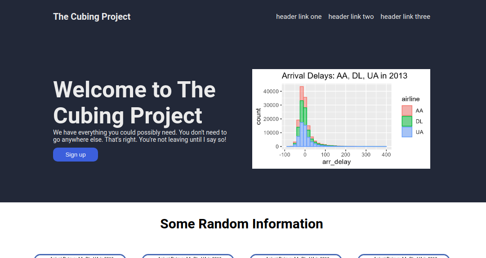

# Website reconsturction project

A small web project where I reconstruct a popular website format by only looking at a reference image.

## How It's Made:

**Tech used:** HTML, CSS

In this project, I practice formatting through flexbox, as well as utilizing div heiarchy in HTML to center and format different headings, containers, and various layouts. I also explore various visual changes that can be made with css such as removal of link underlines, rounded corners, and different font-weight and sizes.

## Optimizations/Other

One optimization I made to my HTML code was indicating the start of each container element in my website using comments for readabiliity and organization. I also made sure to use proper indent formatting for nested divs. 

This is one of the more fun projects that I've made so far using HTML and CSS because I can finally combine all the things that I've learned so far to make a final and *somewhat* finished project! I am very exicted to improve my skills even further!
